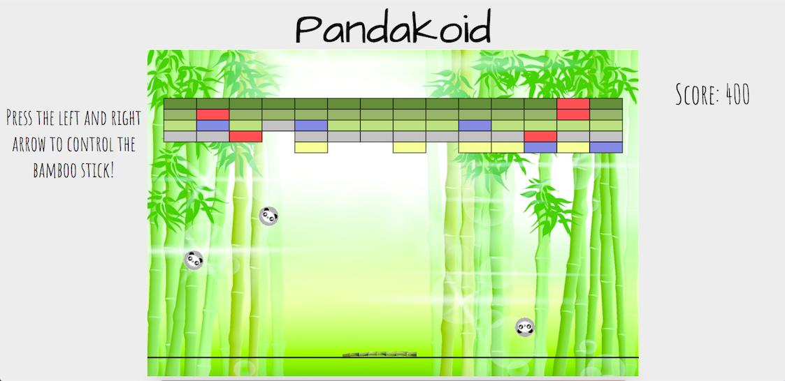

# Pandakoid

[Live][pandakoid]

[pandakoid]: bbchui.github.io

Pandakoid is a browser-based game inspired by the arcade classic **_Arkanoid_**. The goal is to destroy all the blocks on the screen before the panda ball hits the ground.

## Instructions

Press the enter key to start the game. You will use the left and right arrows to move the bamboo stick to bounce the panda back up and prevent it from falling. There are two different power-ups. One will prevent a panda ball from falling to the ground and the other will give you more panda balls. When all your panda balls hit the ground, you lose!



## Languages and Libraries
- Javascript
- CSS/HTML5
- EaselJS

## Implementation

Pandakoid uses Javascript's EaselJS library to create a smooth reactive response to keydown events.

```
class Bamboo {
  constructor(game) {
    this.game = game;
    this.stage = game.stage;
    this.bamboo = new createjs.Bitmap('./assets/images/bamboo.png');
    this.keys = {};
    document.onkeydown = this.keydown.bind(this);
    document.onkeyup = this.keyup.bind(this);
  }

  keydown(event) {
     this.keys[event.keyCode] = true;
  }

  keyup(event) {
     delete this.keys[event.keyCode];
  }

  playerAction() {
    if (this.keys[37] && this.bamboo.x > 9) this.bamboo.x -= 9;
    if (this.keys[39] && this.bamboo.x < 740) this.bamboo.x += 9;
  }
```
The panda balls collision is constantly checked at 12 points around it's circumference to make accurate ball-to-block collision detection.

```
checkCollision(block) {
  for (let i = 0; i < 12; i++) {
    let posX;
    let posY;
    this.calculate(block, i, ((block, dx, dy) => {
      let x = Math.abs(this.panda.x + dx - block.posX);
      let y = Math.abs(this.panda.y + dy - block.posY);
      posX = x;
      posY = y;
    }).bind(this))
    if (posX < 25 && posY < 5) {
      return true;
    }
  }
}

calculate(block, i, cb) {
  let dx = 20 * Math.cos(720 * (Math.PI/360) * (i/12));
  let dy = 20 * Math.sin(720 * (Math.PI/360) * (i/12));
  cb(block, dx, dy);
}
```

## Future Implementations

* Adding multiple stages to the game
* Adding more different power-ups
* Adding sound on collision
