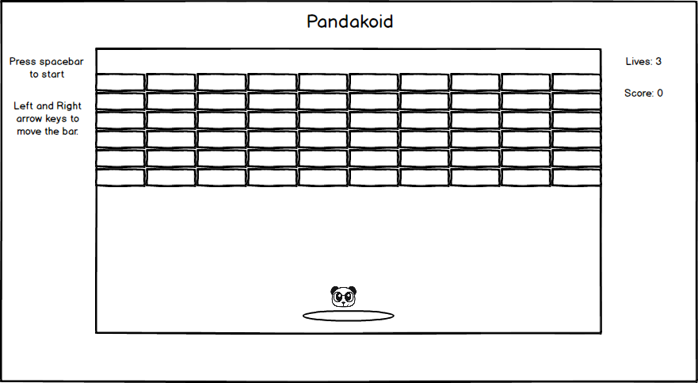

# Pandakoid

## Background

Pandakoid is a Javascript recreation of the arcade game Arkanoid by Taito. The goal of each level is to break the blocks using the spinning panda while the panda bounces off the bamboo stick. If the panda hits the ground, the player will lose one life.

## Functionality and MVP

- [ ] Bamboo stick will be able to move left and right using the arrow keys
- [ ] The score will be shown and updated after each broken block
- [ ] The panda will move faster or slower depending on where it bounces off the bamboo stick
- [ ] Background music that can be toggled on/off
- [ ] Production ReadMe

## Wireframe

This game will be a single-page app with the instructions, game board, life count, and score. Links to my Github and LinkedIn will also be included at the end.

## Architecture and Technologies

### Technology
* Javascript and Jquery for structure and game logic
* Easel.js with HTML5 Canvas for rendering
* Webpack to bundle

### Architecture
* board.js for walls and blocks
* bamboo.js for game control
* panda.js for the panda bouncing physics

## Implementation Timeline

Day 1: Initial module setup, webpack configuration, skeleton Javascript files, review Canvas, and start learning Easel.

Day 2: Create board and bamboo control for game. Continue learning Easel for fluid game piece movement. Implement controls for player.

Day 3: Implement Panda bouncing physics and sound.

Day 4: Style game and implement any missing features.

## Bonus Features
* Panda/Bamboo power-ups
* More levels
